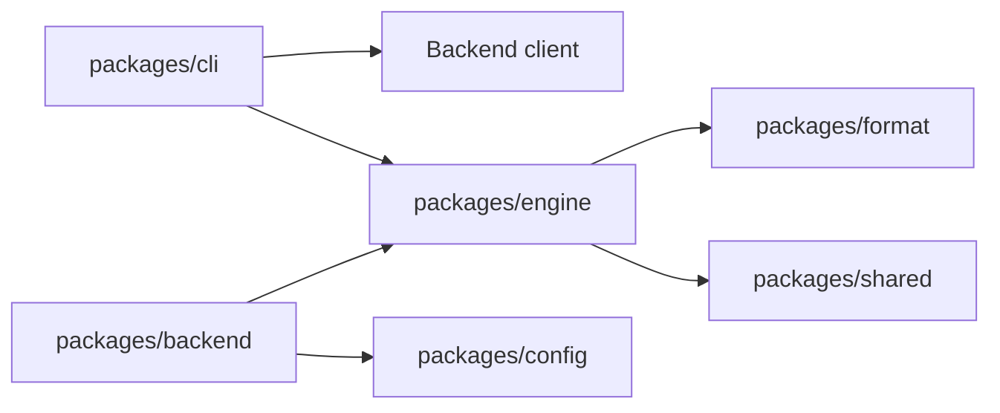
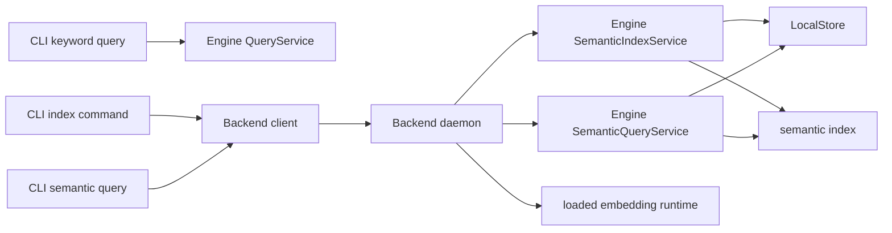

# Semantic Query v1：服务边界、依赖关系与阶段顺序

状态：semantic index 由 #116 交付，semantic query 由 #122 交付；当前 worktree 已实现 #114 的按需 runtime 和 #128 的 install 后同步 index。本文记录包边界和运行时路径；#115、#85 与 Hybrid 仍是后续独立阶段。最后更新：2026-09-13。

## 当前结论

Engine 拥有检索语义和 Store 派生数据；Backend 是承载本地模型与长任务的服务进程；CLI 是命令入口、client 和 JSON 协议边界。

当前已有两条 Backend 路径：semantic index 与默认 semantic query。

```text
CLI index command
  → Backend client
  → Backend index operation
  → Engine SemanticIndexService
  → LocalStore + semantic index

CLI semantic query
  → Backend client
  → Backend query operation
  → Engine SemanticQueryService
  → LocalStore + semantic index
```

Backend 在进程内把已加载的 embedding runtime 适配给 Engine。Engine 不依赖 Backend、CLI、Elysia 或模型运行时。

`lore query` 未指定 `--mode` 时走 semantic 路径；`--mode keyword` 保持 `CLI → Engine`，不需要 Backend、模型或网络。

## 包依赖图



CLI 可以依赖 Engine 和 Backend；Backend 可以依赖 Engine；Engine 不得反向依赖 Backend 或 CLI。

## 运行时边界



keyword query 保持 `CLI → Engine`，维持零配置和离线行为。semantic index 与 semantic query 都使用 `CLI → Backend client → Backend daemon → Engine`，让已经加载的本地模型在多个 CLI 调用间复用。Engine 不导入 Backend；Backend controller 只适配 Engine 用例，不重写 Store、index 或 ranking 规则。

## 责任与数据范围

| 区域 | 责任 |
| --- | --- |
| Engine LocalStore | canonical Practice、来源、digest、Store snapshot 和 revision history |
| Engine semantic index | Profile/Store binding、staging、增量 build、向量校验、原子发布和状态判定 |
| Backend | daemon 生命周期、模型准备、index/query operation、busy 和错误映射 |
| CLI | 参数解析、`--store-root`、按 mode 选择执行路径、Backend client 和 JSON envelope |
| config | 用户级模型配置和 Backend runtime 配置 |

模型配置、模型缓存和 Backend 地址是用户级数据；Store 和 semantic index 属于各自的 `--store-root`。index 是可删除、可重建的派生数据，不能作为 Practice 正文事实来源。

## semantic index 阶段的合同

- `index status` 读取 metadata 和 Store identity，不调用模型。
- `index build` 在 ready 时 no-op；stale 且 revision history 连续时只编码新增或 projection 变化的 Practice；不安全时全量构建。
- `index rebuild` 始终全量构建。
- Engine 在 staging 中完成更新和校验，随后在 Store snapshot fence 内原子替换 active index。
- Backend 一次只接受一个 build/rebuild；当前不持久化 operation，也不排队。
- Backend 未启动、模型未加载、向量非法、Store 变化或构建失败，都返回明确错误并保留旧 active。

详细增量规则见[Semantic index 增量 build](./semantic-index-incremental-build-design.md)。

## 目录归属

```text
packages/engine/src/query/semantic/index/
  service.ts       # no-op、增量、全量选择和发布
  incremental.ts   # affected IDs、删除、复用和编码
  database.ts      # SQLite staging、metadata、向量校验
  metadata.ts      # Profile/Store identity 和兼容性

packages/backend/src/modules/index/
  controller.ts        # HTTP DTO、认证和响应
  operation-service.ts # operation 生命周期与 busy
  model.ts             # status、operation schema

packages/backend/src/modules/query/
  controller.ts        # query DTO、认证和 Engine SemanticQueryService 适配

packages/cli/src/index/
  index-commands.ts    # index 命令、client 和轮询

packages/cli/src/query/
  query-command.ts     # semantic/keyword mode 路由与 JSON envelope
```

Engine 业务逻辑不放在 Backend controller 中。

## 验收与开发入口

当前 worktree 的 Agent 验收直接执行：

```sh
bun packages/cli/src/main.ts --store-root /path/to/isolated-store index status
```

涉及 embedding 的验收先构建 native candidate，再停止 Backend，并用隔离 Store 执行 `install → index operation → query → get`。缺少固定模型时，install/index/query 会按配置自动开始或加入后台准备；验收必须区分 `pending`、`preparing` 和 `ready`，不能因命令已返回就假定模型或 index 就绪。不要使用全局 `lore` 或其他 worktree 的 binary。

必须验证空 Store、首次 build、ready no-op、增量新增/修改/删除、历史缺口全量恢复、Profile/root 隔离、Store snapshot fence、Backend busy 和进程中断。

## 后续范围

[Issue #114](https://github.com/lorelum/lorelum/issues/114) 的按需启动与自动模型准备入口已在当前 worktree 实现，具体行为见[本地模型自动准备与前台非阻塞执行](./automatic-local-model-provisioning-design.md)。[#128](https://github.com/lorelum/lorelum/issues/128) 在 `lore pack install` 的 canonical commit 后同步提交普通增量 build，并把短暂观察的派生 index 结果放入 `data.indexSync`；它不引入后台队列。下一阶段才是 [Issue #115](https://github.com/lorelum/lorelum/issues/115) 的持久任务队列和 CLI 退出后的自动补偿。质量 benchmark、模型评测和多 Profile 留在 [Issue #85](https://github.com/lorelum/lorelum/issues/85)；Hybrid 必须依据这些证据另行设计。
